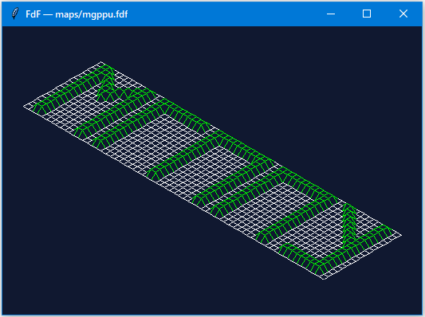

# FdF — каркасная 3D-модель карты высот



---

## Описание

**FdF (Fil de Fer)** — учебный проект, вдохновлённый одноимённым заданием школы 42.
Программа читает файл карты высот формата `.fdf` и отображает поверхность
в виде каркасной (wireframe) 3D-модели в изометрической проекции.

Реализация — на Python 3.12+. Графическая библиотека — `tkinter` (входит в
стандартную поставку Python и не требует установки).

**Возможности:**

- чтение и валидация файла `.fdf` с точной диагностикой ошибок
  (строка, колонка, причина);
- изометрическая проекция точек карты на плоскость окна;
- автоматическое масштабирование и центрирование карты под размер окна;
- перерисовка при изменении размера окна;
- поддержка цвета для отдельных точек (`z,0xRRGGBB`);
- завершение по клавише `Esc` или по закрытию окна;
- покрытие логики модульными тестами, статическая типизация `mypy --strict`,
  линтер `ruff` без замечаний.

---

## Установка и запуск

### Требования

- Python 3.12 или новее;
- `pip` и `venv` (обычно идут в комплекте с Python);
- `tkinter` — входит в стандартную библиотеку. На Linux может понадобиться
  установить системный пакет: `sudo apt install python3-tk`.

### Шаги установки

```bash
# 1. Клонировать репозиторий
git clone https://github.com/MaxStdt/fdf-python.git
cd fdf-python

# 2. Создать виртуальное окружение
python -m venv .venv

# 3. Активировать его
#   Windows (PowerShell):
.venv\Scripts\Activate.ps1
#   Windows (cmd):
.venv\Scripts\activate.bat
#   macOS / Linux:
source .venv/bin/activate

# 4. Установить зависимости для разработки
python -m pip install --upgrade pip
python -m pip install pytest mypy ruff

# 5. (опционально) установить сам пакет в editable-режиме
python -m pip install -e .
```

### Запуск

```bash
python main.py maps/42.fdf
```

Если файл не указан или указано несколько — печатается справка и возвращается
код `2`. Если файла нет или формат неверный — сообщение в `stderr` и код `1`.

### Коды возврата

| Код | Когда возвращается |
|-----|---------------------|
| `0` | Успешное завершение (окно закрыто) |
| `1` | Ошибка ввода-вывода или ошибка формата карты |
| `2` | Неверное число аргументов командной строки |

### Примеры

```bash
python main.py maps/elem.fdf          # простая карта 5x5
python main.py maps/42.fdf            # карта с надписью "42"
python main.py maps/mgppu.fdf         # карта с надписью "МГППУ"
python main.py maps/pyramid.fdf       # пирамида 21x21
python main.py maps/waves.fdf         # синусоидальные волны 30x30
python main.py maps/terrain.fdf       # холмистая местность 40x40
```

---

## Управление

| Клавиша | Действие |
|---------|----------|
| `Esc`   | Завершить работу программы |
| Закрытие окна (крестик) | Завершить работу программы |
| Изменение размера окна | Автоматическая перерисовка с новым масштабом |

---

## Формат карты

Файл карты — текстовый. Каждая строка файла соответствует ряду точек
(координата `y`), позиция значения в строке — координате `x`,
само значение — высоте `z`.

### Правила

- все строки содержат одинаковое количество значений;
- пустые строки в конце файла игнорируются;
- значения разделяются одним или несколькими пробелами;
- высота — целое число, допускаются отрицательные значения;
- к значению через запятую может быть добавлен цвет точки —
  шестнадцатеричное число вида `0xRRGGBB`:

  ```
  20,0xFF0000
  ```

- ведущие нули в цвете допускается опускать (`0xff` эквивалентно `0x0000FF`);
- регистр букв в цвете произвольный;
- цвет может быть задан у части точек.

### Пример `maps/elem.fdf`

```
0 0 0 0 0
0 2 2 2 0
0 2 5 2 0
0 2 2 2 0
0 0 0 0 0
```

### Пример с цветом

```
0 0 0 0 0
0 2,0xFF8800 2,0xFF8800 2,0xFF8800 0
0 2,0xFF8800 5,0xFFD700 2,0xFF8800 0
0 2,0xFF8800 2,0xFF8800 2,0xFF8800 0
0 0 0 0 0
```

### Ошибки формата

Парсер возбуждает `MapFormatError` с указанием строки и колонки. Например:

```
строка 2, колонка 3: 'x' — не целое число
строка 2, колонка 4: '0xZZ0000' — некорректный цвет
строка 3, колонка 6: разная длина строк: ожидалось 5, получено 4
```

Отсутствие файла — стандартный `OSError`, парсер его не перехватывает.
Сообщение пользователю формирует `main.py`.

---

## Структура проекта

```
fdf-python/
├── main.py              # точка входа: аргументы, коды возврата, запуск
├── pyproject.toml       # настройки pytest, mypy, ruff
├── README.md            # этот файл
├── .gitignore           # служебные файлы не попадают в git
├── fdf/                 # пакет с логикой
│   ├── __init__.py
│   ├── errors.py        # FdfError, MapFormatError
│   ├── parser.py        # чтение и валидация .fdf → Map
│   ├── model.py         # Point, Map (модель данных)
│   ├── projection.py    # изометрия, Camera.fit, проекция
│   └── app.py           # tkinter-окно, Canvas, отрисовка рёбер
├── maps/                # примеры карт
│   ├── elem.fdf         # 5x5, центральная высота 5
│   ├── flat.fdf         # все нули, проверка формы ромба
│   ├── mgppu.fdf        # надпись МГППУ
│   ├── 42.fdf           # надпись "42"
│   ├── pyramid.fdf      # 21x21, пирамида
│   ├── terrain.fdf      # 40x40, холмистая местность
│   └── bad/             # карты с ошибками формата
│       ├── empty.fdf
│       ├── ragged.fdf
│       ├── non_integer.fdf
│       ├── bad_color.fdf
│       └── bad_color_short.fdf
├── tests/               # модульные тесты
│   ├── test_parser.py
│   ├── test_model.py
│   ├── test_projection.py
│   └── test_public.py
└── docs/
    └── screenshot.png   # скриншот приложения
```

### Назначение модулей

| Модуль | Роль |
|--------|------|
| `main.py` | Разбор аргументов командной строки, обработка ошибок, коды возврата, запуск `App` |
| `fdf/errors.py` | Иерархия исключений: `FdfError` (базовое), `MapFormatError` (формат карты с позицией) |
| `fdf/parser.py` | Чтение `.fdf`, проверка формата, построение `Map`. Единственное место, где открывается файл |
| `fdf/model.py` | Модель данных: `Point` (неизменяемая точка), `Map` (матрица точек, `len`, `iter`, `neighbors`) |
| `fdf/projection.py` | Математика: изометрия, `Camera.fit` (масштаб + центрирование), `Camera.apply` |
| `fdf/app.py` | Единственный GUI-модуль: окно, Canvas, рёбра, Esc, реакция на resize |

### Ключевая идея архитектуры

Логика (`parser`, `model`, `projection`) **не зависит** от графической
библиотеки. GUI импортируется только в `fdf/app.py`. Это позволяет:

- тестировать логику без дисплея;
- заменять `tkinter` на `pygame`, `PyQt` и др. без правок в парсере и модели;
- использовать парсер в скриптах, не поднимая окно.

---

## Тесты

### Команды

```bash
pytest -q
mypy --strict fdf main.py
ruff check .
```

Перед каждым pull request должны успешно выполняться все три команды.

### Что покрыто тестами

- **Парсер** (`tests/test_parser.py`):
  - размер `elem.fdf` — 5×5, высота центральной точки — 5;
  - координаты точек соответствуют позиции в файле;
  - по одному тесту на каждую ошибку формата
    (`pytest.raises(MapFormatError)`) на картах из `maps/bad/`;
  - разбор значений через `@pytest.mark.parametrize`:
    `"7"`, `"-3"`, `"2,0xFF8800"`, `"1,0xff"`;
  - позиция ошибки (строка и колонка) указана верно.

- **Модель** (`tests/test_model.py`):
  - `len(map)` — общее число точек;
  - обход в цикле `for`;
  - `neighbors` для угловой точки и для середины;

- **Проекция** (`tests/test_projection.py`):
  - точка `(0, 0, 0)` переходит в `(0, 0)`;
  - точка `(0, 0, 1)` имеет отрицательную координату `Y`;
  - оси `x` и `y` направлены в правильные стороны;
  - после `Camera.fit` все точки лежат в пределах окна;
  - карта центрируется;
  - карта из одной точки не вызывает деления на ноль.

Минимальный объём — 8 тестов соблюден.

### Покрытие

```bash
python -m pip install pytest-cov
pytest --cov=fdf --cov-report=term-missing
```

`fdf/app.py` покрыт не полностью — это ожидаемо, GUI тестами не
покрывается.

### Публичный интерфейс (`tests/test_public.py`)

Отдельный набор тестов проверяет **публичный контракт** пакета `fdf`:
существуют ли модули, классы и функции с ожидаемыми именами и сигнатурами.
Такие тесты называются **smoke-тестами** или **контрактными тестами**:
они не проверяют логику, но мгновенно ловят случайное переименование,
удаление или перемещение публичных сущностей.

#### Что проверяется

**1. Пакет и модули существуют и импортируются**

- пакет `fdf`;
- `fdf.errors`, `fdf.parser`, `fdf.model`, `fdf.projection`, `fdf.app`.

**2. Публичные сущности в модулях**

| Модуль | Что должно быть |
|--------|-----------------|
| `fdf.errors` | `FdfError`, `MapFormatError`; `MapFormatError` — наследник `FdfError`; `FdfError` — наследник `Exception` |
| `fdf.parser` | `parse_map` |
| `fdf.model` | `Point`, `Map` (оба класса) |
| `fdf.projection` | `Camera` (класс), `project` (функция) |
| `fdf.app` | `App` (класс) |

**3. Сигнатуры публичных функций и методов**

| Сущность | Ожидаемая сигнатура |
|----------|---------------------|
| `parse_map` | `parse_map(path)` — один параметр `path` |
| `Point` | dataclass с полями `x`, `y`, `z`, `color` |
| `Map.point` | `(self, y, x)` |
| `Map.neighbors` | `(self, y, x)` |
| `Map` | имеет `__len__`, `__iter__` |
| `Camera.fit` | `(self, map_, width, height, z_scale)` |
| `Camera.apply` | метод существует |
| `project` | `(point, scale, offset_x, offset_y, z_scale)` |
| `App.__init__` | `(self, map_, title)` |

---

## Лицензия
OPENSOURCE